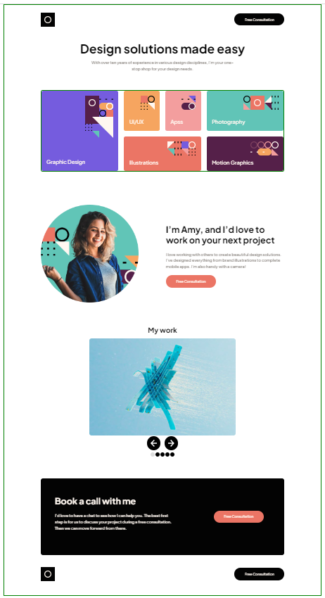

# Frontend Mentor - Single-page design portfolio solution

This is a solution to the [Single-page design portfolio challenge on Frontend Mentor](https://www.frontendmentor.io/challenges/singlepage-design-portfolio-2MMhyhfKVo). Frontend Mentor challenges help you improve your coding skills by building realistic projects. 

## Table of contents

- [Overview](#overview)
  - [The challenge](#the-challenge)
  - [Screenshot](#screenshot)
  - [Links](#links)
- [My process](#my-process)
  - [Built with](#built-with)
  - [What I learned](#what-i-learned)
  - [Continued development](#continued-development)
  - [Useful resources](#useful-resources)
- [Author](#author)
- [Acknowledgments](#acknowledgments)


## Overview

### The challenge

Users should be able to:

- View the optimal layout for the site depending on their device's screen size
- See hover states for all interactive elements on the page
- Navigate the slider using either their mouse/trackpad or keyboard

### Screenshot




### Links

- Solution URL: [Add solution URL here](https://github.com/ghintema/FrontEndMentor_Single-page-design-portfolio.git)
- Live Site URL: [Add live site URL here](https://ghintema.github.io/FrontEndMentor_Single-page-design-portfolio/)

## My process
- Design analysis: extracting font-styles and colors from figma-file.
- defining CSS variables
- defining CSS utility classes
- writing markup, including styles via utility classes
- writing layout for mobile design
- writing layout for tablet and/or desktop

### Built with

- Semantic HTML5 markup
- CSS custom properties
- Custom CSS Utility classes for fonts and style for max mantainability 
- Flexbox
- CSS Grid
- Mobile-first workflow
- No frameworks used.


### What I learned

How to build a purely css-slider and the limitations of css for this task.
Thanks a lot to https://ebene11.com/imageslider-ohne-javascript

Limitations are: 
- Nav-Buttons are part of each slider, therefore sliding with the slid.
- navigation in the loop is not possible.

### Continued development

In future: Exchanging the slider for a more sophisiticated JavaScritp one.

## Author

Harm Intemann, Bolivia, August 2022

## Acknowledgment

System of utility classes according to Kevin Powell.

```html
<h1>Some HTML code I'm proud of</h1>
```
```css
.proud-of-this-css {
  color: papayawhip;
}
```
```js
const proudOfThisFunc = () => {
  console.log('🎉')
}
```

